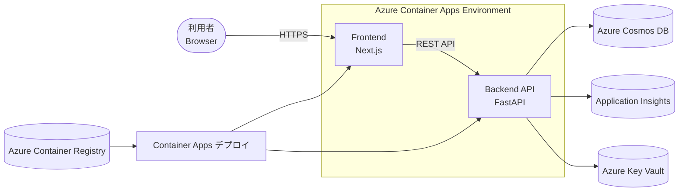
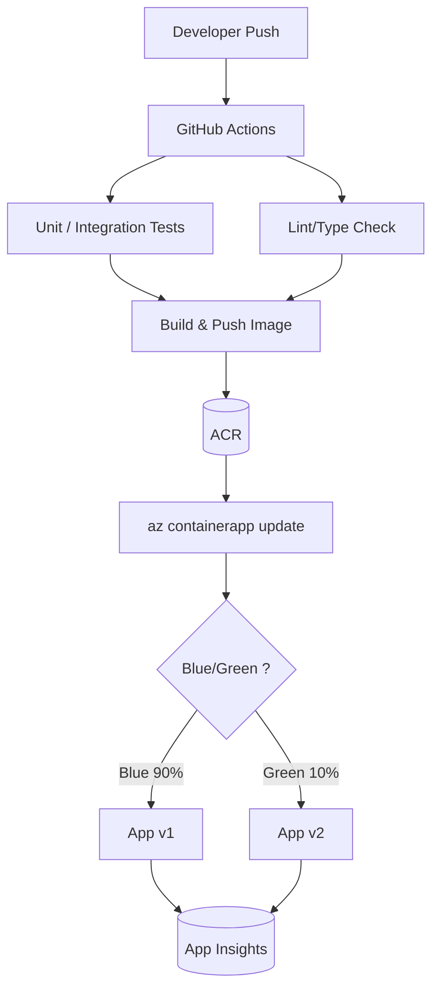
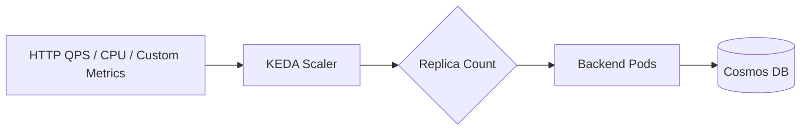
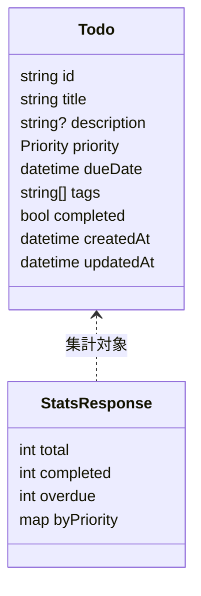

# Azure Container Apps TODO管理アプリ

クラウドネイティブ開発を学習するための実践的なTODO管理アプリケーションです。フロントエンドとバックエンドを分離したマイクロサービスアーキテクチャを採用し、Azure Container Appsでホストします。

## アーキテクチャ概要
主要コンポーネントとデータフローを Mermaid 図で示します。

### 基本コンポーネント構成


### コンテナビルド / デプロイ CI/CD パイプライン


### スケーリング（リクエスト/メトリクスベース）


### データモデル（概要）


> Blue/Green デプロイ時は `trafficWeights` を利用して段階的に新バージョン (Green) へトラフィックを移行します。

## 機能一覧

- **タスク管理**: CRUD操作（作成・読込・更新・削除）
- **優先度管理**: 4段階の優先度設定（低・中・高・緊急）
- **期限管理**: 期限設定と期限切れアラート
- **タグ機能**: カテゴリ分類とフィルタリング
- **検索・フィルタ**: 条件に基づくタスク検索
- **統計表示**: 完了率とタスク統計の可視化
- **レスポンシブUI**: デスクトップ・タブレット・モバイル対応

## 技術スタック

### フロントエンド
- **Next.js 15+**: Reactベースのフレームワーク (SSR / SSG / ISR)
- **TypeScript**: 型安全な開発
- **React 18+**: UIライブラリ
- **SWR**: クライアントデータフェッチ & キャッシュ
- **Axios**: APIクライアント
- **Tailwind CSS** (任意): スタイリング
- **Node.js 20+ / npm**: 実行・パッケージ管理

### バックエンド
- **FastAPI**: 高性能Python Webフレームワーク
- **Pydantic**: データバリデーション・シリアライゼーション
- **Azure Cosmos SDK**: Cosmos DBクライアント
- **Uvicorn**: ASGIサーバー

### データベース
- **Azure Cosmos DB**: NoSQLデータベース（Serverlessモード）
-- **パーティション戦略**: 単一パーティション (userId 廃止)

### インフラ・DevOps
- **Azure Container Apps**: サーバーレスコンテナプラットフォーム
- **Azure Container Registry**: コンテナイメージリポジトリ
- **GitHub Actions**: CI/CDパイプライン
- **Application Insights**: アプリケーション監視

## プロジェクト構成

```
todo-app/
├── frontend/                    # Next.js フロントエンド
│   ├── src/
│   │   ├── app/                # App Router (または pages/)
│   │   │   ├── layout.tsx
│   │   │   └── page.tsx
│   │   ├── components/         # 再利用 UIコンポーネント
│   │   ├── lib/                # APIクライアント・ユーティリティ
│   │   ├── hooks/              # カスタムフック
│   │   ├── types/              # 型定義 (Todo, APIレスポンス)
│   │   └── styles/             # グローバル/モジュールCSS
│   ├── public/                 # 画像・静的アセット
│   ├── next.config.mjs         # Next.js 設定
│   ├── package.json            # 依存関係
│   ├── tsconfig.json           # TypeScript設定
│   ├── tailwind.config.js      # Tailwind設定 (使用時)
│   ├── postcss.config.js       # PostCSS設定
│   ├── .env.example            # 環境変数サンプル
│   └── Dockerfile              # コンテナ設定
├── backend/                    # FastAPI バックエンド
│   ├── src/
│   │   ├── main.py                 # ルーティング/アプリ (例外ハンドラ含む)
│   │   ├── domain/
│   │   │   ├── models/todo.py      # ドメイン Todo モデル
│   │   │   └── repositories/todo_repository.py
│   │   ├── application/services/todo_service.py
│   │   └── infrastructure/repositories/
│   │       ├── in_memory_todo_repository.py
│   │       └── cosmos_todo_repository.py (簡易)
│   ├── tests/
│   │   ├── test_health.py
│   │   ├── test_todos.py
│   │   ├── test_conflict.py
│   │   ├── test_validation.py
│   │   └── test_cosmos_repo.py
│   ├── requirements.txt
│   └── Dockerfile
├── infra/                     # インフラストラクチャ
│   ├── bicep/                # Bicepテンプレート
│   │   ├── main.bicep
│   │   ├── container-apps.bicep
│   │   └── cosmos-db.bicep
│   └── scripts/              # デプロイメントスクリプト
│       ├── deploy.sh
│       └── blue-green-deploy.sh
├── .github/                  # GitHub Actions
│   └── workflows/
│       ├── ci.yml           # 継続的インテグレーション
│       ├── cd.yml           # 継続的デプロイメント
│       └── monitoring.yml   # 監視設定自動化
├── docs/                    # ドキュメント
│   ├── ARCHITECTURE.md      # アーキテクチャ詳細
│   ├── DEVELOPMENT.md       # 開発ガイド
│   └── DEPLOYMENT.md        # デプロイメントガイド
├── docker-compose.yml       # ローカル開発環境
├── .gitignore
└── README.md               # このファイル
```

フロントエンド詳細設計/要件: `frontend/README.md` を参照。

## 開発環境セットアップ

### 前提条件

- Node.js 20以上 (Frontend)
- Python 3.12以上 (Backend)
- Docker Desktop
- Azure CLI 2.56以上
- Git

### ローカル開発環境構築

1. **リポジトリのクローン**
```bash
git clone https://github.com/yourusername/azure-container-apps-todo.git
cd azure-container-apps-todo
```

2. **依存関係インストール**
```bash
# バックエンド (FastAPI)
cd backend
python -m venv venv
# Windows PowerShell
venv\\Scripts\\Activate.ps1
pip install -r requirements.txt

# フロントエンド (Next.js)
cd frontend
npm install   # または: npm ci (lockfile ありの場合)
```

3. **環境変数の設定**
```bash
# backend/.env
COSMOS_ENDPOINT=https://your-cosmos-account.documents.azure.com:443/
COSMOS_KEY=your-cosmos-primary-key
COSMOS_DATABASE=TodoApp
LOG_LEVEL=DEBUG

# frontend/.env.local
NEXT_PUBLIC_API_BASE_URL=http://localhost:8000
```

4. **ローカル実行**
```bash
# バックエンド起動 (Hot Reload)
cd backend
uvicorn src.main:app --reload --port 8000

# フロントエンド起動 (Next.js Dev Server)
cd frontend
npm run dev -- --port 3000
```

5. **動作確認**
- フロントエンド: http://localhost:3000
- バックエンドAPI: http://localhost:8000
- API ドキュメント: http://localhost:8000/docs

### Docker Compose による開発環境

```bash
# 全サービス起動
docker-compose up --build

# バックグラウンド実行
docker-compose up -d

# ログ確認
docker-compose logs -f

# 停止・クリーンアップ
docker-compose down -v
```

## ローカル動作確認詳細ガイド（コンテナ未使用 / Docker Compose）

ホスト実行 (Python / Node を直接起動) と Docker Compose の2通りを選択できます。高速なコード検証はホスト、コンテナ間通信や本番に近い挙動検証は Compose を利用してください。

### 環境変数ファイル整理

| 用途 | パス | 例 | 備考 |
|------|------|----|------|
| Backend (ホスト) | `backend/.env` | COSMOS_DISABLE=1 | `python-dotenv` が自動読込 |
| Backend (Compose) | `backend/.env.container` | COSMOS_CONNECTION_STRING=... | `docker-compose.yml` の `env_file` で利用可能 |
| Frontend (ホスト) | `frontend/.env.local` | NEXT_PUBLIC_API_BASE_URL=http://localhost:8000 | Next.js 自動読込 |
| Frontend (Compose) | `frontend/.env.local.container` | NEXT_PUBLIC_API_BASE_URL=http://todo-backend:8000 | DNS 名はサービス名 (container_name) |

Cosmos を使わないフェーズでは `COSMOS_DISABLE=1` を設定して in-memory リポジトリで軽量起動します。

---
### A. コンテナを使わないホスト実行手順

1. Backend 依存インストール
  ```powershell
  cd backend
  python -m venv .venv
  .venv\\Scripts\\Activate.ps1
  pip install -r requirements.txt
  ```
2. `backend/.env` 作成 (最小例)
  ```env
  LOG_LEVEL=INFO
  COSMOS_DISABLE=1
  ```
3. Backend 起動
  ```powershell
  uvicorn src.main:app --reload --port 8000
  ```
4. Frontend 依存インストール & 起動 (別ターミナル)
  ```powershell
  cd frontend
  npm install
  echo NEXT_PUBLIC_API_BASE_URL=http://localhost:8000 > .env.local
  npm run dev
  ```
5. 動作確認
  - http://localhost:3000 で UI
  - http://localhost:8000/health で 200
  - http://localhost:8000/docs で OpenAPI
6. Cosmos 利用へ切替
  - `.env` の `COSMOS_DISABLE` を削除し接続情報 (ENDPOINT/KEY など) を追記 → 再起動
7. テスト
  ```powershell
  cd backend
  pytest -q
  ```

#### ホスト実行 利点 / 注意
| 観点 | 利点 | 注意 |
|------|------|------|
| 起動/反映 | 最速 | 本番 OS レイヤ差異は再現されない |
| デバッガ | VS Code ブレークポイント容易 | PYTHONPATH 問題が出たら `uvicorn src.main:app` 形式厳守 |

---
### B. Docker Compose 実行手順

1. 環境ファイル準備 (任意)
  ```text
  backend/.env.container
    COSMOS_DISABLE=1
  frontend/.env.local.container
    NEXT_PUBLIC_API_BASE_URL=http://todo-backend:8000
  ```
2. `docker-compose.yml` へ env_file を追加する場合の例
  ```yaml
  services:
    backend:
     env_file:
      - backend/.env.container
    frontend:
     env_file:
      - frontend/.env.local.container
  ```
3. 起動
  ```powershell
  docker compose up --build -d
  ```
4. ログ確認
  ```powershell
  docker compose logs -f backend
  docker compose logs -f frontend
  ```
5. 疎通確認 (frontend コンテナ→backend)
  ```powershell
  docker exec todo-frontend sh -c "apk add --no-cache curl >/dev/null 2>&1 || true; curl -s http://todo-backend:8000/health"
  ```
6. 変更反映
  - Python: `--reload` により即時反映
  - Next.js: dev サーバがホットリロード
7. 停止 / クリーンアップ
  ```powershell
  docker compose down            # ボリューム保持
  docker compose down -v         # 依存キャッシュも削除
  ```

#### Compose 利点 / 注意
| 観点 | 利点 | 注意 |
|------|------|------|
| 本番近似 | コンテナ境界 / DNS 名解決再現 | 初回ビルド時間がかかる |
| チーム統一 | Dockerfile による再現性 | node_modules/venv ボリューム差異で不整合時は `down -v` |

---
### トラブルシュート (ローカル)

| 症状 | 原因 | 対処 |
|------|------|------|
| 502 fetch failed (Compose) | `NEXT_PUBLIC_API_BASE_URL` が localhost | `http://todo-backend:8000` に修正 |
| ImportError domain.* | PYTHONPATH 未設定 | Compose: `PYTHONPATH=/app/src` / ホスト: `uvicorn src.main:app` |
| Cosmos 初期化遅延 | 接続情報不足 | 一旦 `COSMOS_DISABLE=1` で無効化 |
| 変更反映されない | キャッシュイメージ | `docker compose build --no-cache <service>` |

---
### 選択ガイド

| シナリオ | 推奨 |
|----------|------|
| 早い反復 | ホスト |
| 本番類似検証 | Compose |
| Dockerfile 最適化 | Compose |
| デバッグ集中 | ホスト |

不足あれば Issue で提案してください。

## Azure環境へのデプロイ

### 前提条件

- Azureアカウント
- Azure CLI ログイン済み
- Container Registry へのアクセス権限

### リソース払い出し

```powershell
az login
az account show
```

```powershell
azd auth login
```

### azd で「環境のみ」を払い出す手順

このリポジトリの `infra/main.bicep` はコンテナアプリ本体を作成せず、Log Analytics / ACR / Container Apps Managed Environment / Cosmos DB などの「環境部分」のみを作成する構成になっています。`azd` を使って環境を払い出す手順を示します。

ワークフローの意図:
- まず azd で環境のみを払い出す（ACR にイメージが無くても失敗しない）
- イメージをビルドして ACR に push
- Container Apps 本体は CLI（`az containerapp create` / `az containerapp update`）で作成または更新する

前提: `azure.yaml` がリポジトリにあり、azd がプロジェクトのインフラを参照できる状態であること

1) azd にログインしてサブスクリプションを選択

```powershell
az login
az account set --subscription <SUBSCRIPTION_ID>
azd auth login
```

2) azd 環境変数を用意（対話を避けるためローカル env に設定）

例: `dev` 環境名で払い出す場合

```powershell
# 環境名
azd env set --local envName dev

# (任意) ACR 名を明示する場合
azd env set --local acrName myuniquearc0123

# Cosmos の Free Tier を使う場合
azd env set --local enableCosmosFreeTier true

# 必要な他のパラメータも同様に azd env set --local <name> <value>
```

3) 環境のみを払い出す

```powershell
# azd up は infra を払い出し、コードビルドやイメージpushも行います。
# 本テンプレートはアプリ本体を作らないため、azd up を実行すると環境のみが作成されます。
azd up

# あるいは non-interactive にしたい場合 (既に env に値を設定済みなら):
azd up --no-wait
```

4) 出力値や設定値の確認

```powershell
# ACR の FQDN
azd env get-value acrLoginServer

# Container Apps Environment の ID
azd env get-value environmentId

# Cosmos のエンドポイント (シークレットは azd が secure に扱います)
azd env get-value cosmosEndpoint
```

5) イメージをビルドして ACR に push

```powershell
az acr login --name $(azd env get-value acrName)
docker build -f backend/Dockerfile -t $(azd env get-value acrLoginServer)/backend:latest ./backend
docker push $(azd env get-value acrLoginServer)/backend:latest

docker build -f frontend/Dockerfile -t $(azd env get-value acrLoginServer)/frontend:latest ./frontend
docker push $(azd env get-value acrLoginServer)/frontend:latest
```

前提:
- Azure CLI にログイン済み (az login)
- ACR 名 (例: myuniquearc0123) または ACR の login server (例: myuniquearc0123.azurecr.io) を把握していること

基本フロー:
1. ACR にログイン
2. docker compose でイメージをビルド（または既にビルド済み）
3. ローカルイメージに ACR の FQDN を使ってタグ付け（または Compose の image を FQDN にしておく）
4. ACR に push

```powershell
# 変数を設定
$ACR_NAME = "myuniquearc0123"
# ACR の login server を取得し、先頭/末尾の空白を除去
$ACR_LOGIN_SERVER = (az acr show -n $ACR_NAME --query loginServer -o tsv).Trim()

# ACR にログイン（az が内部で docker login を実行します）
az acr login --name $ACR_NAME

# docker compose でビルド（または既にビルド済み）
docker compose build

# ローカルイメージ名を確認（オプション）
docker images --format "{{.Repository}}:{{.Tag}}\t{{.ID}}" | Select-String "frontend|backend"

# 例: ローカルイメージが 'frontend:latest' / 'backend:latest' の場合、ACR 用にタグ付けして push
docker tag udemy-containerapps-cicd-aiapp-frontend:latest $ACR_LOGIN_SERVER/frontend:latest
docker tag udemy-containerapps-cicd-aiapp-backend:latest  $ACR_LOGIN_SERVER/backend:latest

docker push $ACR_LOGIN_SERVER/frontend:latest
docker push $ACR_LOGIN_SERVER/backend:latest
```

1) Container Apps 本体を作成または既存アプリを更新

リソース名やタグなど可変な値は事前に PowerShell の環境変数に設定しておくと、手順が読みやすくなりミスを減らせます。以下は推奨される手順例です。

```powershell
# --- 事前に設定する変数（例） ---
$RESOURCE_GROUP      = $(azd env get-value AZURE_RESOURCE_GROUP)      # azd を使っている場合
$ENV_NAME            = $(azd env get-value envName)                    # Managed Environment 接頭辞
$ACR_LOGIN_SERVER    = $(azd env get-value acrLoginServer)            # ACR の FQDN
$FRONTEND_APP_NAME   = "todo-frontend"                               # 任意の App 名
$BACKEND_APP_NAME    = "todo-backend"                                # 任意の App 名
$FRONTEND_IMAGE_TAG  = "frontend:latest"                             # またはリリースタグ
$BACKEND_IMAGE_TAG   = "backend:latest"

# --- Managed Environment の ID を取得 ---
$ENV_ID = az containerapp env show --name "${ENV_NAME}-cae" --resource-group $RESOURCE_GROUP --query id -o tsv

# --- 新規作成例 (Backend) ---
az containerapp create \
  --name $BACKEND_APP_NAME \
  --resource-group $RESOURCE_GROUP \
  --environment $ENV_ID \
  --image $ACR_LOGIN_SERVER/$BACKEND_IMAGE_TAG \
  --ingress internal \
  --target-port 80 \
  --registry-server $ACR_LOGIN_SERVER

# --- 新規作成例 (Frontend) ---
az containerapp create \
  --name $FRONTEND_APP_NAME \
  --resource-group $RESOURCE_GROUP \
  --environment $ENV_ID \
  --image $ACR_LOGIN_SERVER/$FRONTEND_IMAGE_TAG \
  --ingress external \
  --target-port 80 \
  --registry-server $ACR_LOGIN_SERVER

# --- 既存アプリのイメージ差し替え例 (Backend) ---
az containerapp update \
  --name $BACKEND_APP_NAME \
  --resource-group $RESOURCE_GROUP \
  --image $ACR_LOGIN_SERVER/$BACKEND_IMAGE_TAG
```

補足:
- `azd` を使って環境を払い出している場合は `azd env get-value <name>` で値を取得して変数にセットできます。上の例ではそれを利用しています。
- 上記はシェル変数（PowerShell のスコープ）として設定する例です。セッションを跨いで永続化したい場合は `Set-Item -Path Env:VAR -Value "value"` 等で環境変数に設定してください。
- 本番運用では `:latest` ではなくコミット SHA やバージョンタグを使う運用を推奨します。

注意点:
- Container Apps の Managed Identity に `AcrPull` ロールを付与する必要があります。azd のプロビジョンで自動付与が行われる場合もありますが、必要に応じて以下のように手動実行できます。

```powershell
az role assignment create --assignee-object-id <APP_PRINCIPAL_ID> --role AcrPull --scope $(az acr show -n $(azd env get-value acrName) --query id -o tsv)
```

- `azd up` は infra とアプリを一括で実行するコマンドです。今回のテンプレートはアプリ作成を行わないため `azd up` を使って環境のみ安全に払い出せます。

---


```powershell
(.venv) AzureContainerApps\src > azd up
? Enter a unique environment name: todoapp

New environment 'todoapp' created and set as default
? Select an Azure Subscription to use:  1. shirokuma (f80766c9-6be7-43f9-8369-d492efceff1e)
? Enter a value for the 'backendImage' infrastructure parameter: [? for help] backend
? Enter a value for the 'backendImage' infrastructure parameter: backend
? Enter a value for the 'envName' infrastructure parameter: learn
? Enter a value for the 'frontendImage' infrastructure parameter: frontend
? Pick a resource group to use: 1. Create a new resource group
? Enter a name for the new resource group: (rg-todoapp)

? Enter a name for the new resource group: rg-todoapp
```

## API仕様

### エンドポイント一覧

| Method | Endpoint | Description | 備考 |
|--------|----------|-------------|------|
| POST | `/api/todos` | 作成 | createdAt/updatedAt サーバ生成 |
| GET | `/api/todos` | 一覧 | フィルタ/ページング未実装 |
| GET | `/api/todos/{id}` | 取得 | 404 when not found |
| PATCH | `/api/todos/{id}` | 部分更新 | title/description/priority/dueDate/tags |
| PATCH | `/api/todos/{id}/complete` | 完了化 | 冪等 / updatedAt 更新 |
| PATCH | `/api/todos/{id}/reopen` | 未完へ戻す | 冪等 / updatedAt 更新 |
| DELETE | `/api/todos/{id}` | 削除 | 204 / 404 |
| GET | `/health` | Liveness |  |
| GET | `/health/ready` | Readiness | Cosmos 接続後 ready 化予定 |

### リクエスト例

```bash
# TODO作成
curl -X POST "http://localhost:8000/api/todos" \
  -H "Content-Type: application/json" \
  -d '{
    "title": "Container Apps学習",
    "description": "Azure Container Appsの基礎を学習する",
    "priority": "high",
    "dueDate": "2025-08-15T18:00:00Z",
    "tags": ["学習", "Azure"]
  }'

# TODO一覧取得（現在フィルタ未対応）
curl "http://localhost:8000/api/todos"
```

エラーフォーマット例:
```
404: {"detail":{"type":"not_found","id":"<id>"}}
409: {"detail":{"type":"duplicate_todo_id","id":"<id>"}}
422: {"detail":{"type":"validation_error","errors":[{"field":"priority","message":"...","errorType":"string_pattern_mismatch"}]}}
500: {"detail":{"type":"internal_server_error","message":"Internal Server Error","status":500}}
```

詳細なAPI仕様は http://localhost:8000/docs で確認できます。エラーフォーマットの完全な仕様は [backend/README.md のエラーレスポンス仕様](backend/README.md#エラーレスポンス仕様) を参照してください。

## テスト

### 単体テスト実行

```bash
# バックエンドテスト
cd backend
pytest tests/ -v --cov=src

# カバレッジレポート生成
pytest tests/ --cov=src --cov-report=html
```

### 統合テスト実行

```bash
# Docker環境でのE2Eテスト
docker-compose -f docker-compose.test.yml up --build --abort-on-container-exit
```

## 監視・運用

### ヘルスチェック

- **Liveness probe**: `/health`
- **Readiness probe**: `/health/ready`

### メトリクス

Application Insightsを通じて以下を監視：
- HTTP リクエスト数・レスポンス時間
- エラー率・例外発生数
- Cosmos DB Request Unit消費量
- コンテナリソース使用率

### ログ

構造化ログを出力し、Application Insightsで集約：
```json
{
  "timestamp": "2025-01-01T12:00:00Z",
  "level": "INFO",
  "message": "TODO created successfully",
  "todo_id": "todo_12345",
  "duration_ms": 145
}
```

## CI/CD パイプライン

### ワークフロー

1. **CI（継続的インテグレーション）**
   - コード品質チェック（Black、flake8、mypy）
   - セキュリティスキャン（Bandit、Trivy）
   - 単体テスト・統合テスト実行
   - Dockerイメージビルド・レジストリプッシュ

2. **CD（継続的デプロイメント）**
   - ステージング環境デプロイ
   - 統合テスト実行
   - 本番環境ブルーグリーンデプロイ
   - ヘルスチェック・ロールバック

> GitHub Actions の詳細な設定手順は [GITHUB_ACTIONS_SETTINGS.md](./docs/GITHUB_ACTIONS_SETTINGS/GITHUB_ACTIONS_SETTINGS.md) を参照してください。

## パフォーマンス最適化

### フロントエンド
- ISR / SSG の活用による初期表示高速化
- SWR によるクライアントキャッシュ & 再検証
- Bundle 分割 / Dynamic Import / Tree Shaking
- Next.js Image Optimization / Font 最適化
- HTTP/2 & Compression (gzip/br) / CDNキャッシュ

### バックエンド
- Cosmos DBクエリ最適化（パーティションキー活用）
- 非同期処理によるI/O待機時間短縮
- レスポンス圧縮・キャッシュヘッダー設定

### インフラ
- Container Appsスケーリング設定調整
- Cosmos DB RU最適化
- CDNによる静的コンテンツ配信

## セキュリティ

### 実装済み
- 入力値バリデーション（Pydantic）
- CORS設定
- HTTPSの強制
- シークレット管理（Azure Key Vault）

### 今後の拡張予定
- ユーザー認証・認可（Azure AD B2C）
- API レート制限
- セキュリティヘッダー強化

## トラブルシューティング

### よくある問題

1. **Cosmos DB接続エラー**
   ```
   解決方法: 環境変数COSMOS_ENDPOINTとCOSMOS_KEYを確認
   ```

2. **フロントエンドでAPIエラー**
   ```
   解決方法: CORS設定とAPI_BASE_URL環境変数を確認
   ```

3. **コンテナ起動失敗**
   ```
   解決方法: dockerイメージのヘルスチェック設定を確認
   ```

詳細は [TROUBLESHOOTING.md](docs/TROUBLESHOOTING.md) を参照してください。

## コントリビューション

1. このリポジトリをフォーク
2. 機能ブランチを作成 (`git checkout -b feature/amazing-feature`)
3. 変更をコミット (`git commit -m 'Add amazing feature'`)
4. ブランチにプッシュ (`git push origin feature/amazing-feature`)
5. Pull Requestを作成

## ライセンス

このプロジェクトは MIT ライセンスの下で公開されています。詳細は [LICENSE](LICENSE) ファイルを参照してください。

## お問い合わせ・サポート

- **Issues**: [GitHub Issues](https://github.com/yourusername/azure-container-apps-todo/issues)
- **Discussions**: [GitHub Discussions](https://github.com/yourusername/azure-container-apps-todo/discussions)
- **Email**: your.email@example.com

## 参考資料

- [Azure Container Apps Documentation](https://docs.microsoft.com/azure/container-apps/)
- [FastAPI Documentation](https://fastapi.tiangolo.com/)
- [Next.js Documentation](https://nextjs.org/docs)
- [Azure Cosmos DB Documentation](https://docs.microsoft.com/azure/cosmos-db/)
- [講座学習ガイド](docs/COURSE_GUIDE.md)

## IaC によるリソース払い出し (azd + Bicep)

このプロジェクトは `azure.yaml` と `infra/` 以下の Bicep モジュールで Azure リソースを一括デプロイできます。手動 `az` コマンド列より再現性とロール割り当て (AcrPull) 自動化が向上します。

### プロビジョン全体像
- リソースグループ (任意: azd が自動生成/選択)
- Log Analytics Workspace
- Container Apps Environment
- Azure Container Registry (任意: `acrName` を指定した場合のみ)
- Cosmos DB (Serverless / Free Tier オプション)
- Backend / Frontend Container Apps (System-assigned Managed Identity 付与)
- ACR AcrPull ロール割り当て (ACR 利用時のみ)

### 前提ツール
- Azure CLI 2.56+ (`az upgrade`)
- Azure Developer CLI (azd) 1.x+ : https://learn.microsoft.com/azure/developer/azure-developer-cli/
- Docker (ローカルビルド時)

### 初回セットアップ手順
```powershell
# 1. ログイン (必要に応じてテナント指定)
az login

# 2. サブスクリプション確認 / 切り替え
az account show
# 切替例: az account set --subscription <SUBSCRIPTION_ID>

# 認証
azd auth login

# デプロイ (インフラ + ビルド + イメージ Push + コンテナアプリ更新)
azd up
```

> NOTE: `acrName` を空にすると ACR/ロール割り当ては作成されず、`backendImage` / `frontendImage` には **Fully Qualified** (例: `ghcr.io/owner/image:tag`) なパブリックリポジトリを指定してください。

### パラメータ / 環境変数 (env.<ENV>.json に保存)
| 名前 | 用途 | 例 | 必須 |
|------|------|----|------|
| envName | 論理環境接頭辞 | dev | ✅ |
| backendImage | Backend コンテナイメージ (FQ も可) | backend:latest | ✅ |
| frontendImage | Frontend コンテナイメージ | frontend:latest | ✅ |
| acrName | ACR 名 (指定時 Private Pull) | myuniquereg123 | 任意 |
| enableCosmosFreeTier | Cosmos Free Tier 使用 | true/false | 任意 |
| cosmosDatabaseName | DB 名 | TodoApp | 任意 |
| cosmosContainerName | コンテナ名 | Todos | 任意 |
| cosmosPartitionKey | パーティションキー | /id (または固定) | 任意 |

### 再デプロイ
コード/インフラ更新後:
```powershell
azd deploy            # コード + (変更あれば) インフラ差分反映
```

### イメージタグ更新 (リリース時)
CI で新しいタグを発行したら:
```powershell
azd env set backendImage backend:v2025.08.31
azd env set frontendImage frontend:v2025.08.31
azd deploy
```

### ロール割り当て (AcrPull) について
- `acrName` 指定時、自動で Container Apps の Managed Identity に AcrPull を付与。
- 反映確認:
```powershell
az role assignment list --assignee $(azd env get-value BACKEND_PRINCIPAL_ID) --scope $(az acr show -n $(azd env get-value acrName) --query id -o tsv)
```
(参考: 変数名は出力に合わせて調整してください。)

### クリーンアップ
```powershell
# 作成されたリソースグループを削除 (不可逆)
az group delete --name <RESOURCE_GROUP> --yes --no-wait
```

### トラブルシュート (azd)
| 症状 | 原因候補 | 対処 |
|------|----------|------|
| Image pull error | AcrPull 未反映 / イメージ未 Push | `az acr repository list -n <acr>` で確認、`az role assignment list` 再確認 |
| Cosmos 認証失敗 | KEY 未同期 | `azd deploy` 再実行、シークレット値ローテーション確認 |
| The subscription is not registered | プロバイダ未登録 | `az provider register -n Microsoft.App` 他を登録 |