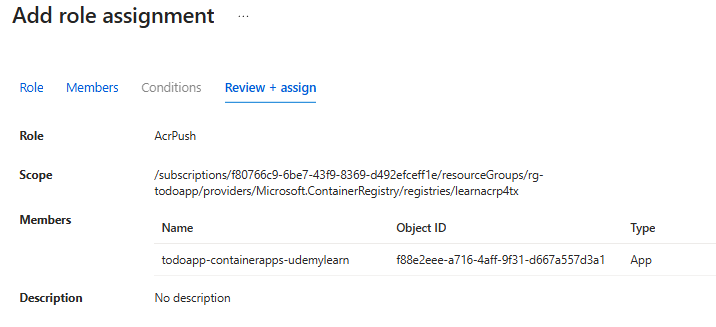
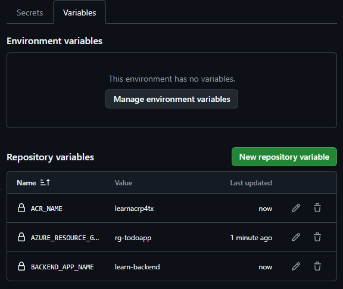

# GitHub Actions 設定手順

本ドキュメントは Backend コンテナ (FastAPI) を Azure Container Apps に自動デプロイするための GitHub Actions 設定ガイドです。`backend-deploy.yml` ワークフローは `develop` (ステージング) / `main` (本番) で挙動を自動切替します。

---
## 1. Azure 側準備 (初回のみ)

> 既に azd / Bicep で Container Apps, ACR, Cosmos を作成済みであることを前提

1. Azure AD アプリ登録 (Service Principal) を作成。
   - 「App registration」
   
   - 名前を入力して作成
   
   - TENANT_IDをコピー (Directory Id)
   - CLIENT_IDをコピー（Application ID）
2. Federated Credential (OIDC) を 追加:
   - 「Certificates & secrets」ページの「Federated credentials」の「Add credentials」
   
   - Organization：GitHub組織名またはGitHubユーザ名
   - Repository：GitHubリポジトリ名
   - Entity type：Branch
   - GitHub branch name：ブラランチ名（main）
   - Credentials details - Name：Credentialの名前
   
3. ロール割り当て (リソースグループ / ACR):
   - Resource Group: `Azure Container Apps Contributor` (もしくは `Contributor`)
   
   
   
   
   
   - ACR: `AcrPush`
   
   
   
   
   

---
## 2. リポジトリ Secrets / Variables 登録
GitHub → Settings → Secrets and variables → Actions。

| 種別 | キー | 例 / 説明 |
|------|-----|-----------|
| Secret | `AZURE_CLIENT_ID` | アプリ登録の Client ID |
| Secret | `AZURE_TENANT_ID` | テナント ID |
| Secret | `AZURE_SUBSCRIPTION_ID` | サブスクリプション ID |
| Variable | `AZURE_RESOURCE_GROUP` | 例: `rg-todo-app` |
| Variable | `ACR_NAME` | 例: `mytodoacr123` |
| Variable | `BACKEND_APP_NAME` | 例: `todo-backend` |

機密性の高い値 (Cosmos 接続文字列など) を直接注入する場合は Secret に追加し、ワークフロー内で `--set-env-vars` を利用してください。




---
## 3. ワークフロー配置と役割
`./.github/workflows/backend-deploy.yml` が以下を実施:
- push (main / develop) または手動トリガで発火
- Python 依存インストール & pytest 実行
- Docker Build → ACR Push
- Container App `update || create`
- main ブランチ: min=2 / max=5 レプリカ, 最新リビジョンへ 100% トラフィック
- develop ブランチ: min=1 / max=2 レプリカ

---
## 5. 初回 / 既存リソース状態
- 既存 (azd provision 済み) → そのまま update で差分反映
- 未作成 → update が失敗し create にフォールバックし初回生成

---
## 6. よくあるエラーと対処
| 症状 | 原因 | 対処 |
|------|------|------|
| AuthorizationFailed | ロール不足 | RG/ACR の Role Assignment を再確認 (AcrPush + Container Apps Contributor) |
| manifest unknown | Push 前に update | Build/Push ステップ失敗ログを確認 |
| Image pull failed | AcrPull 権限不足 | Managed Identity の AcrPull 付与 (Bicep or az role assignment) |
| python: command not found | setup-python 省略 | ワークフローファイル改変箇所を確認 |

---
## 8. 手動ロールバック手順
```bash
az containerapp revision list -n $BACKEND_APP_NAME -g $RESOURCE_GROUP -o table
az containerapp ingress traffic set -n $BACKEND_APP_NAME -g $RESOURCE_GROUP --revision-weight <stableRevision>=100
```

---
## 9. 監視 / ログ確認コマンド
```bash
az containerapp logs show -n $BACKEND_APP_NAME -g $RESOURCE_GROUP --follow
az containerapp show -n $BACKEND_APP_NAME -g $RESOURCE_GROUP --query properties.latestRevisionName -o tsv
```